<!-- Meta Badges -->
<!-- 
 -->
<!---->
<!--  -->
<!--  -->
<!--  -->
<!---->
<!-- 
 -->
<!-- Unified Profile Terminal Widget -->

<!-- stats badge -->

<!--  -->

[%3D'text'%5D%5Blast()%5D&label=VISITORS&style=for-the-badge&color=73daca&labelColor=1f2335&logo=github&logoColor=a9b1d6)](https://github.com/frtzhahn)

